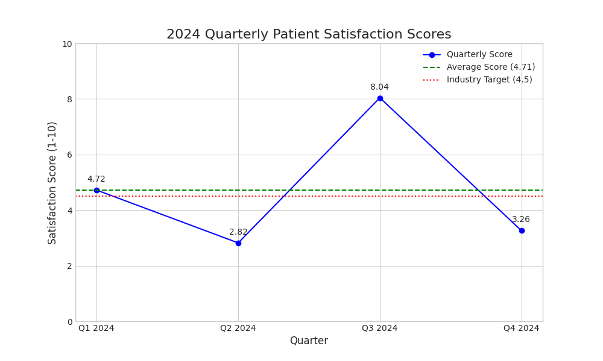

# Data Story: Uncovering Patient Satisfaction Volatility

**Analysis for:** Executive Team, Healthcare Performance Division  
**Author's Email (Verification):** 24ds2000075@ds.study.iitm.ac.in

--- 

### 1. Executive Summary

This analysis addresses the concerning trend in patient satisfaction scores. While initial reports indicated an average score of 3.8, a detailed review of the 2024 quarterly data reveals a more nuanced situation. The actual calculated average for 2024 is **4.71**, which is above the industry target of 4.5.

The core issue is not the annual average, but rather the **extreme volatility** in performance between quarters. Our scores fluctuated wildly from a low of 2.82 to a high of 8.04. This inconsistency points to systemic issues in service quality and wait times, creating an unpredictable and unreliable patient experience. Our primary recommendation is to shift focus from the average score to stabilizing quarterly performance.

### 2. The Data vs. The Perception

Management's concern was based on a perceived average of 3.8. The official 2024 data paints a different picture:

| Quarter | Patient Satisfaction Score |
| :------ | :------------------------- |
| Q1 2024 | 4.72                       |
| Q2 2024 | 2.82                       |
| Q3 2024 | 8.04                       |
| Q4 2024 | 3.26                       |
| **Average** | **4.71** |
| **Target** | **4.5** |

The visualization below clearly illustrates this trend and the stark contrast between quarters.

### 3. Key Findings & Business Implications

* **Extreme Volatility:** The massive 5.22-point swing between Q2 and Q3 is a major red flag. This indicates our patient service is highly inconsistent.
* **Reputational Risk:** The poor performance in Q2 and Q4 likely generated negative reviews and word-of-mouth, damaging our brand reputation despite the high average.
* **Operational Inefficiency:** Such drastic swings suggest underlying problems with resource allocation, staffing levels, or patient flow management that vary significantly throughout the year.
* **Patient Trust Erosion:** Patients who experience the "lows" of Q2 and Q4 lose trust in our services, making them less likely to return or recommend us.

### 4. Actionable Recommendations

To achieve consistent, high-quality service and sustainably meet our **4.5** target, we recommend the following actions focused on **improving service quality and wait times**:

1.  **Conduct a Root Cause Analysis:** Initiate a deep dive into the operational differences between the high-performing quarters (Q1, Q3) and the low-performing ones (Q2, Q4). We should analyze staffing levels, patient volume, wait time data, and specific patient feedback from these periods.
2.  **Standardize Service Delivery Protocols:** Develop and implement standardized patient service protocols across all departments. This will help reduce variability and ensure a consistent level of care regardless of the quarter.
3.  **Implement a Dynamic Staffing Model:** Use historical patient volume and wait time data to create a more responsive staffing model that can anticipate and manage peak periods, thereby reducing wait times and staff burnout during challenging quarters.

By addressing this volatility, we can create a dependably positive experience for all patients and solidify our reputation as a top-tier healthcare provider.
